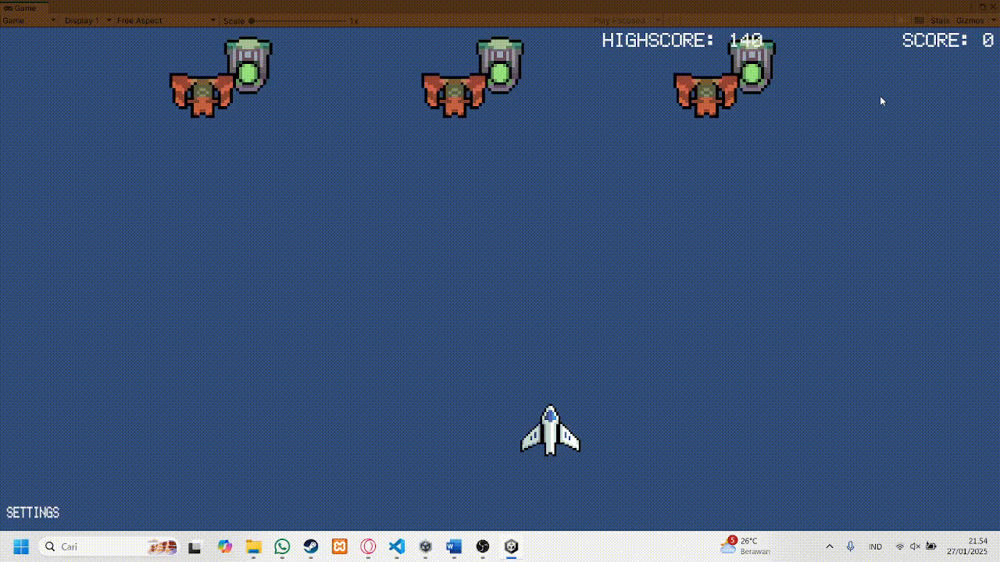

# Hello, I'm Realdy

### About Me
**Hello! My name is Mochammad Realdy Anrizsa Putra, but you can call me Realdy**. I am currently a student at Bina Nusantara University, pursuing a major in Game Application and Technology. I am seeking an internship opportunity where I can apply and further develop my skills in game development, while also acquiring new knowledge and experiences. Additionally, I aim to familiarize myself with a professional working environment and contribute meaningfully to your team.

### Education
S.Kom. in Game Application and Technology, Faculty of School of Computer Science, Bina Nusantara University, 2022 - Present.

## Projects
### Dome Diner
> .gif)
> Dome Diner is a casual diner and time management game set in a human colony in Mars. A game inspired by Diner Dash completely made in Unity.
> | [itch.io](https://kreiglist.itch.io/dome-diner)
> | [Github Repository](https://github.com/Kreiglist/Dome-Diner)

### Top Shooter
> 
> Top Shooter is a dynamic top shooter game where I applied my knowledge and skills in game development to create an engaging and immersive experience.
> | [Github Repository](https://github.com/Kreiglist/2602153480---SpaceInvaderAOL)

